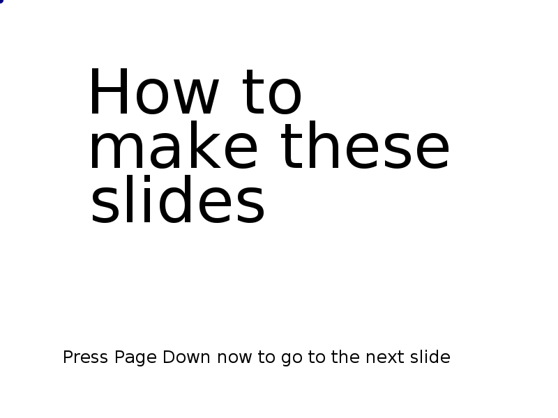

# How to make these slides - Instructions for making these slides and the editor for it

## Running

These slides require [guitktk](https://github.com/asrp/guitktk) to run. Put the content of both this and guitktk into the same directory.

    git clone https://github.com/asrp/guitktk
    git clone https://github.com/asrp/maketheseslides

Copy these two files to the cloned directory (or specify full path). Install requirements.

    cp maketheseslides/*.py guitktk
    cd guitktk
    pip install -r requirements.txt

Then start

    python flow_editor.py slides.py

Run this in the console (enter this in the field labelled `Exec:` and press enter)

    doc.load('slide_doc.py')

(or create text ('t') containing just `!doc.load('slide_doc.py')` and click on it).

The title page of the slides should appear. Follow the instructions therein.

Start editing your slides right away. Do not wait for your editor to be complete before editing. The saved document will be compatible across different versions of the slide editor as it is made!

Be careful when overwriting saved files. The default file is `saved_doc.py` and is overwritten when `doc.save` is called, without confirmation. Backups are made in the `saved` subdirectory.

After the fifth slide, the instructions assume knowledge of default keybindings in `functions.py` (or at least some other way to perform the same actions, like through the console). These bindings are reproduced under the *Default UI* heading below.

## Backends

guitktk's default backend is Tkinter (for maximum compatibility) but they will also run with the `xcb` backend that looks nicer. Edit `config.py` before running to switch backends.

## Editing these slides

The instructions included are for creating your own slides and an editor for it. Here are some instructions on editing these slides. On top of the default keybindings, here are extra keys added for editing these slides.

- **Shift-i** Toggle overlay UI interface visibility (scroll down to see more of the interface)
- **i** Switch to editing overlay UI (and back)
- **Shift-p** Toggle points visibility
- **+/-** (not on numpad) Increase/decrease font in selection

May be added to `functions.py` later on:

- **Escape** Clear selection
- **Shift-s** Enter selection (to select and edit inside)
- **Shift-s** Exit selection (when entered using Shift-s)
- **c** Copy selection to current slide (can be from the same slide)
- **Shift-m** Move selection to current slide

Already documented from within the slides

- **Page down** Next slide
- **Page up** Previous slide
- **Right arrow** Next transition
- **Left arrow** Previous transition

If you do fix something, please make a pull request! If you make a better version, send a link so it can be added to this readme.

## Default UI

Here are the bindings for the default UI from guitktk's readme copies here

- Add new text: `t`, edit the text (or button (`!` prefix) or status bar (`=` prefix)). Press enter when done
- Edit text: `t` with mouse cursor over text
- Add line: `l`
- Add rectangle: `r`
- Move points (blue filled circles): `e` with mouse over the point, move the mouse cursor, `e` again when done
- Select: `s` with mouse cursor over element selects/deselects the element
- Group selection: `g`
- Ungroup selection: `u`
- Move selection: `m`, move mouse cursor, `m` again when done
- Delete selection: `x`
- Set autolayout for selection: `f`
- Zoom: Ctrl + mouse wheel
- Scroll: mouse wheel and shift + mouse wheel
- Activate button: left mouse click
- Reload: Ctrl + r
